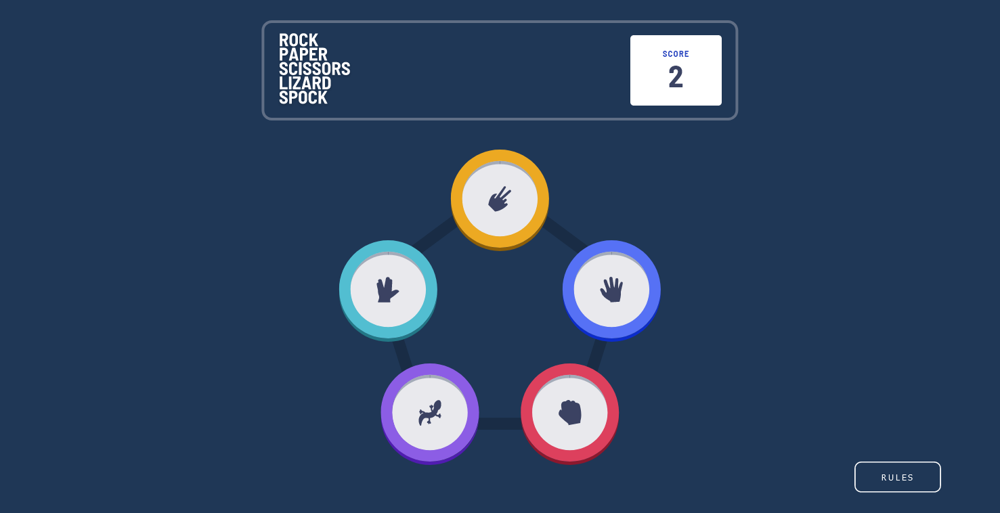

# Rock, Paper, Scissors, Lizard, Spock

## The challenge

Users should be able to:

- View the optimal layout for the game depending on their device's screen size
- Maintain the state of the score after refreshing the browser
- Play Rock, Paper, Scissors, Lizard, Spock against the computer

### Rules

If the player wins, they gain 1 point. If the computer wins, the player loses one point.

#### Original

- Scissors beats Paper
- Paper beats Rock
- Rock beats Lizard
- Lizard beats Spock
- Spock beats Scissors
- Scissors beats Lizard
- Paper beats Spock
- Rock beats Scissors
- Lizard beats Paper
- Spock beats Rock

### Screenshot

## My process

### Built with

- Semantic HTML5 markup
- CSS custom properties
- Flexbox
- Mobile-first workflow
